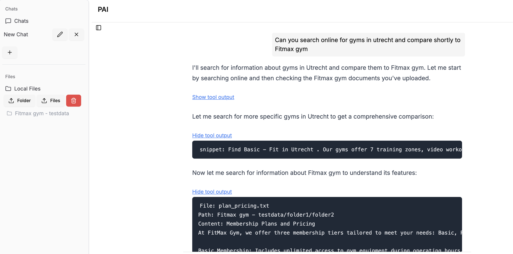
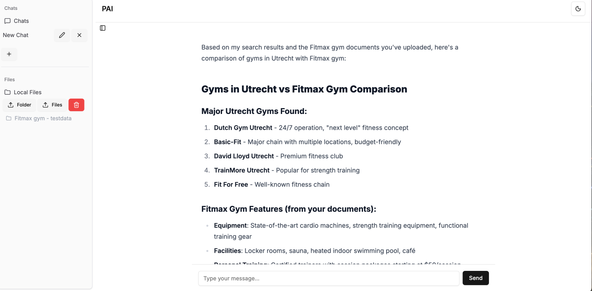
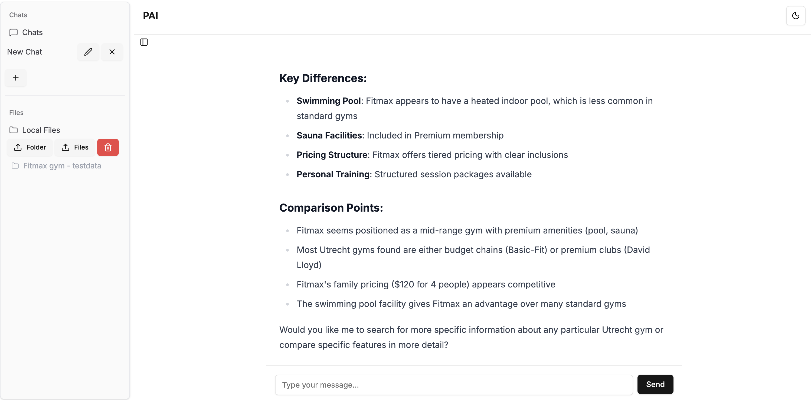

# Frontend Chatbot - PAI (Personal AI)

This is the **frontend** of the WebAI project, built with [Next.js](https://nextjs.org/) and React.  
It provides the user interface for interacting with the AI chatbot powered by a **FastAPI backend** (separate repo: [backend_chatbot](https://github.com/BobKeijzer/backend_chatbot)).

The frontend supports:

- Creating and managing chat sessions  
- Sending messages to the backend AI  
- Uploading files and folders for RAG workflows  
- Viewing chat history and responses  
- Dark mode and responsive layout  

---

## Features

- **Next.js 13** app using app directory & SSR  
- **React hooks** for state management (chats, files, etc.)  
- **File & folder uploads** integrated with backend RAG indexing  
- **Sidebar navigation** for chats and documents  
- **Theme support** with dark/light mode  

---

## Getting Started (Local)

### Prerequisites

- Node.js v22.19.0  
- [pnpm](https://pnpm.io/) v10.15.1  

### Installation
```bash
git clone https://github.com/BobKeijzer/frontend_chatbot.git
cd frontend_chatbot

# Install dependencies
pnpm install
```

### Environment Variables

Create a `.env` file in the root (ignored by git):

```env
NEXT_PUBLIC_BACKEND_URL=http://localhost:8000
```

In [Vercel](https://vercel.com), set env variables through project settings instead of using `.env`.

### Running Locally

```bash
pnpm dev
```

Frontend will be available at:
[http://localhost:3000](http://localhost:3000)

### Building for Production

```bash
pnpm build
pnpm start
```

---

## Deployment Plans

* Frontend hosted on **Vercel** (Next.js SSR support) 
* Connects to **FastAPI backend** (Azure App Services container or code) 

---

## Learning Goals

* Next.js + React responsive frontend for AI apps
* Handling dynamic data, states & API calls to backend
* File uploads and RAG integration
* Connecting frontend + backend across platforms

---

## License

MIT – free for learning and experimentation 

## Screenshots of page
This is the frontend for my chatbot project showing example usage.


